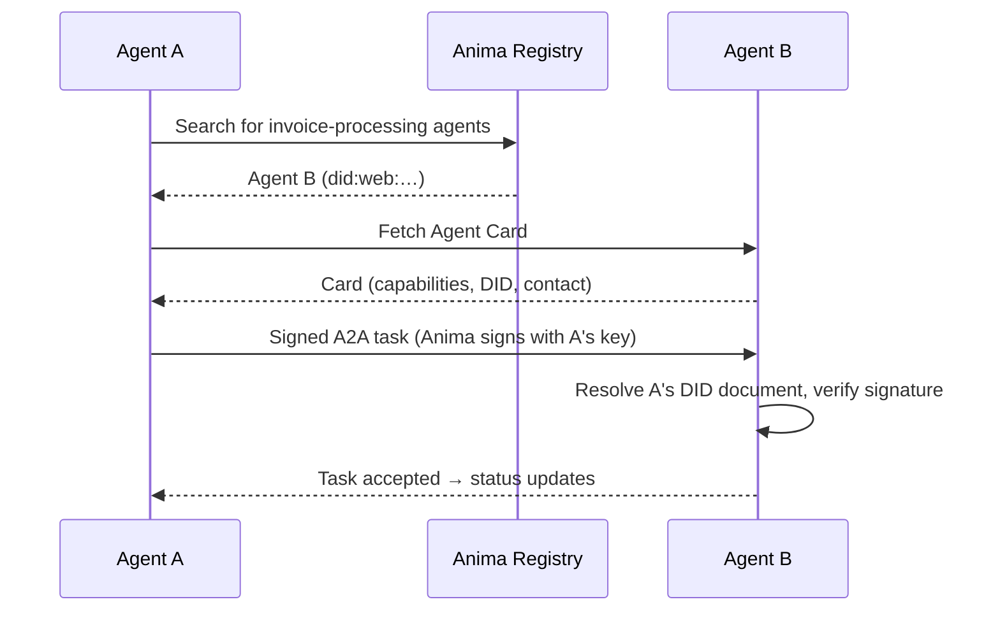

# How We Built Cryptographic Identity for AI Agents with DIDs

> **Updated 2026-07:** Anima's DID method migrated from a custom `did:anima:` method to the standard [`did:web:`](https://w3c-ccg.github.io/did-method-web/) method, and this post has been updated to match what is shipped today. Where a capability is still on the roadmap (automatic credential issuance), it says so.

When an AI agent sends an email, makes a purchase, or calls an API, the receiving party has a reasonable question: **who is this, and should I trust it?**

Today, most agents authenticate with API keys or OAuth tokens. These prove authorization, not identity. They say "this request is allowed" but not "this is agent X, operated by company Y, with these specific capabilities and constraints." That distinction matters as agents start interacting with each other, with vendors, and with compliance systems.

We use the W3C-standard `did:web` method to solve this.

## Why Agents Need Verifiable Identity

There are three forces pushing agents toward cryptographic identity:

### 1. Agent-to-Agent Trust

When agent A contacts agent B to negotiate a contract or request a service, B needs to verify that A is who it claims to be. API keys do not help here — they authenticate a request to a specific service, not an identity across services. DIDs provide a portable, verifiable identity that works across any protocol.

### 2. Compliance and Accountability

Regulators are catching up to agentic systems. SOC 2 auditors want to know which agent performed which action and under whose authority. AML rules require knowing the identity behind financial transactions. A DID ties every action to a verifiable identity with a clear chain of custody.

### 3. Discovery and Interoperability

As the agent ecosystem grows, services need to discover agent capabilities and verify their legitimacy. The combination of DIDs and Agent Cards gives every agent a machine-readable, cryptographically verifiable profile that other systems can query.

## Standard `did:web`, not a custom method

Every agent created on Anima is automatically assigned a DID following the W3C Decentralized Identifiers specification, using the registered `did:web` method:

```
did:web:agents.useanima.sh:<orgId>:<agentId>
```

We deliberately chose `did:web` over inventing a custom method: `did:web` resolution is plain HTTPS, already supported by standard resolver tooling, with nothing bespoke to implement on the verifier side.

The DID resolves to a DID Document containing the agent's public key and authentication methods:

```json
{
  "@context": [
    "https://www.w3.org/ns/did/v1",
    "https://w3id.org/security/suites/jws-2020/v1"
  ],
  "id": "did:web:agents.useanima.sh:cmb1x9k2l0000abcd:cmb1xa3f50001abcd",
  "verificationMethod": [
    {
      "id": "did:web:agents.useanima.sh:cmb1x9k2l0000abcd:cmb1xa3f50001abcd#key-1",
      "type": "JsonWebKey2020",
      "controller": "did:web:agents.useanima.sh:cmb1x9k2l0000abcd:cmb1xa3f50001abcd",
      "publicKeyJwk": { "kty": "OKP", "crv": "Ed25519", "x": "…" }
    }
  ],
  "authentication": ["did:web:agents.useanima.sh:cmb1x9k2l0000abcd:cmb1xa3f50001abcd#key-1"],
  "assertionMethod": ["did:web:agents.useanima.sh:cmb1x9k2l0000abcd:cmb1xa3f50001abcd#key-1"]
}
```

### Key Design Decisions

**Ed25519 keys**: We use Ed25519 for signing because it is fast, produces compact signatures, and is widely supported across platforms. Each agent gets a dedicated key pair at creation time — and the private key is stored encrypted at rest.

**World-readable documents**: DID documents must be verifiable by parties who cannot authenticate to Anima, so they are served publicly with open CORS.

**Automatic provisioning**: You do not need to manage keys or DID documents manually. Creating an agent automatically provisions the DID, generates keys, and publishes the document.

## Resolving and Verifying DIDs

Any system can fetch an Anima agent's DID document — no API key required:

```bash
curl https://api.useanima.sh/.well-known/did/<orgId>/<agentId>
```

The document is served as `application/did+json`. Authenticated callers can also fetch it through the API:

```bash
curl https://api.useanima.sh/v1/agents/<agentId>/did \
  -H "Authorization: Bearer ak_..."
```

This is what powers [signed A2A dispatch](/a2a/overview): Anima signs an outbound task with the sender's key, and the recipient verifies that signature against the sender's published DID document before accepting it.

## Verifiable Credentials

DIDs establish identity. Verifiable Credentials (VCs) establish **attributes** of that identity — "this agent's email is verified", "this org passed billing verification".

Anima's identity layer verifies and revokes W3C VCs today (`POST /v1/identity/verify` checks signature, expiry, and revocation of a JWT VC). **Automatic credential issuance has not shipped yet** — agents don't accumulate credentials on real events (email verified, phone provisioned) until that lands, and Agent Cards honestly report `verification.level: "basic"` in the meantime. See [Verifiable Credentials](/identity/verifiable-credentials) for the current status.

## Agent Cards: machine-readable agent profiles

Every Anima agent has an [Agent Card](/identity/agent-cards) — a machine-readable JSON profile generated from its live state:

```json
{
  "name": "Acme Purchasing Agent",
  "did": "did:web:agents.useanima.sh:cmb1x9k2l0000abcd:cmb1xa3f50001abcd",
  "capabilities": {
    "email": true,
    "phone": true,
    "vault": true,
    "address": false,
    "protocols": ["a2a"]
  },
  "contact": {
    "email": "purchasing@agents.useanima.sh"
  }
}
```

Agent Cards serve the same role for agents that OpenAPI specs serve for APIs: a machine-readable description of what this agent can do and how to reach it. The `capabilities` block is derived from what the agent actually has provisioned — not self-declared.

## Agent Registry

For discovery across your organization, Anima runs an Agent Registry — register your agent, and other agents can find it by capability or DID:

```ts
// Register an agent in the registry
await anima.registry.register({
  agentId: agent.id,
  capabilities: ["procurement", "invoice-processing"],
});

// Discover agents by capability
const { items } = await anima.registry.search("invoice-processing");
```

## Putting It All Together

Here is the flow when Agent A wants to hand a task to Agent B:



Every step is verifiable. Every identity is cryptographic. No shared secrets between agents.

## What This Enables

- **Signature-verified agent-to-agent tasks**: recipients verify the sender's signature against its published DID document before accepting work
- **Compliance reporting**: every action is tied to an identity with a clear [audit trail](/security/audit-log)
- **Standards-based portability**: `did:web` is a registered W3C method — verifiers need no Anima-specific code
- **Key rotation and revocation**: rotate an agent's keypair (`POST /v1/agents/{agentId}/did/rotate`) or revoke credentials at any time

## Start Building

Agent identity is not optional anymore. As agents handle real money, real data, and real decisions, verifiable identity becomes infrastructure.

```ts
const agent = await anima.agents.create({ name: "My Agent" });
// That's it — the agent's did:web identity and DID document are provisioned automatically.
```

[Read the DID method docs](/identity/did-method) | [Explore Verifiable Credentials](/identity/verifiable-credentials) | [Set up Agent Cards](/identity/agent-cards)
