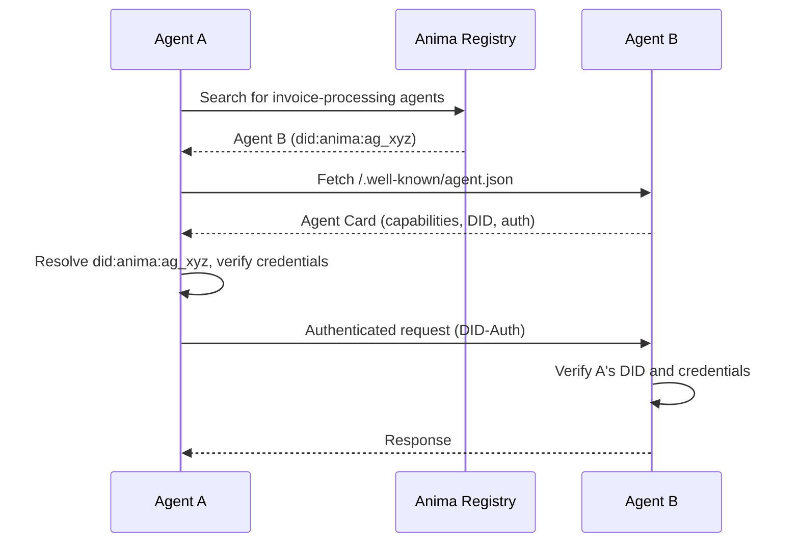

# How We Built Cryptographic Identity for AI Agents with DIDs

When an AI agent sends an email, makes a purchase, or calls an API, the receiving party has a reasonable question: **who is this, and should I trust it?**

Today, most agents authenticate with API keys or OAuth tokens. These prove authorization, not identity. They say "this request is allowed" but not "this is agent X, operated by company Y, with these specific capabilities and constraints." That distinction matters as agents start interacting with each other, with vendors, and with compliance systems.

We built the `did:anima` method to solve this.

## Why Agents Need Verifiable Identity

There are three forces pushing agents toward cryptographic identity:

### 1. Agent-to-Agent Trust

When agent A contacts agent B to negotiate a contract or request a service, B needs to verify that A is who it claims to be. API keys do not help here — they authenticate a request to a specific service, not an identity across services. DIDs provide a portable, verifiable identity that works across any protocol.

### 2. Compliance and Accountability

Regulators are catching up to agentic systems. SOC 2 auditors want to know which agent performed which action and under whose authority. AML rules require knowing the identity behind financial transactions. A DID ties every action to a verifiable identity with a clear chain of custody.

### 3. Discovery and Interoperability

As the agent ecosystem grows, services need to discover agent capabilities and verify their legitimacy. The combination of DIDs and Agent Cards gives every agent a machine-readable, cryptographically verifiable profile that other systems can query.

## The `did:anima` Method

Every agent created on Anima is automatically assigned a DID following the W3C Decentralized Identifiers specification:

```
did:anima:ag_8f3k2m9x1n4p7q6r
```

The DID resolves to a DID Document that contains the agent's public keys, authentication methods, and service endpoints:

```json
{
  "@context": [
    "https://www.w3.org/ns/did/v1",
    "https://w3id.org/security/suites/ed25519-2020/v1"
  ],
  "id": "did:anima:ag_8f3k2m9x1n4p7q6r",
  "authentication": [
    {
      "id": "did:anima:ag_8f3k2m9x1n4p7q6r#key-1",
      "type": "Ed25519VerificationKey2020",
      "controller": "did:anima:ag_8f3k2m9x1n4p7q6r",
      "publicKeyMultibase": "z6Mkf5rGMoatrSj1f..."
    }
  ],
  "service": [
    {
      "id": "did:anima:ag_8f3k2m9x1n4p7q6r#email",
      "type": "AgentEmail",
      "serviceEndpoint": "mailto:agent@acme.useanima.sh"
    },
    {
      "id": "did:anima:ag_8f3k2m9x1n4p7q6r#a2a",
      "type": "AgentToAgent",
      "serviceEndpoint": "https://acme.useanima.sh/.well-known/agent.json"
    }
  ]
}
```

### Key Design Decisions

**Ed25519 keys**: We use Ed25519 for signing because it is fast, produces compact signatures, and is widely supported across platforms. Each agent gets a dedicated key pair at creation time.

**Service endpoints**: The DID Document lists every communication channel the agent supports — email, A2A protocol, webhook URLs. Another agent or service can resolve the DID and know exactly how to reach this agent.

**Automatic provisioning**: You do not need to manage keys or DID documents manually. Creating an agent automatically provisions the DID, generates keys, and publishes the document.

## Resolving and Verifying DIDs

Any system can resolve an Anima DID to get the agent's public identity:

```ts
import { Anima } from "@anima-labs/sdk";

const anima = new Anima({ apiKey: "ak_..." });

// Resolve any agent's DID document
const doc = await anima.identity.resolveDid("did:anima:ag_8f3k2m9x1n4p7q6r");
console.log(doc.authentication); // Public keys
console.log(doc.service);        // Communication endpoints
```

```python
from anima import Anima

anima = Anima(api_key="ak_...")

doc = anima.identity.resolve_did("did:anima:ag_8f3k2m9x1n4p7q6r")
print(doc.authentication)  # Public keys
print(doc.service)         # Communication endpoints
```

Resolution is also available via HTTP for systems that do not use the SDK:

```bash
curl https://api.useanima.sh/v1/identity/did/did:anima:ag_8f3k2m9x1n4p7q6r
```

## W3C Verifiable Credentials

DIDs establish identity. Verifiable Credentials (VCs) establish **attributes** of that identity. Anima issues VCs that attest to specific facts about an agent:

```json
{
  "@context": [
    "https://www.w3.org/2018/credentials/v1",
    "https://useanima.sh/credentials/v1"
  ],
  "type": ["VerifiableCredential", "AgentCapabilityCredential"],
  "issuer": "did:anima:platform",
  "credentialSubject": {
    "id": "did:anima:ag_8f3k2m9x1n4p7q6r",
    "organizationId": "org_acme_corp",
    "capabilities": ["email", "phone", "vault"],
    "complianceStatus": "verified"
  },
  "proof": {
    "type": "Ed25519Signature2020",
    "verificationMethod": "did:anima:platform#key-1",
    "proofValue": "z58DAdFfa9SkqZMVPxAQp..."
  }
}
```

These credentials are cryptographically signed by Anima and can be independently verified by any party. A vendor receiving a request from an agent can verify:

1. The agent's identity (via DID resolution)
2. That the agent belongs to a specific organization
3. What capabilities the agent has

All without calling Anima's API — the proof is in the credential itself.

## Agent Cards: Discovery via `.well-known`

The final piece is discoverability. Every Anima agent can publish an Agent Card at a well-known URL:

```
https://purchasing.acme.com/.well-known/agent.json
```

```json
{
  "name": "Acme Purchasing Agent",
  "description": "Handles procurement for Acme Corp",
  "url": "https://purchasing.acme.com",
  "did": "did:anima:ag_8f3k2m9x1n4p7q6r",
  "version": "1.0.0",
  "capabilities": [
    {
      "name": "purchase-order",
      "description": "Create and manage purchase orders",
      "inputSchema": {
        "type": "object",
        "properties": {
          "vendor": { "type": "string" },
          "items": { "type": "array" },
          "budget": { "type": "number" }
        }
      }
    }
  ],
  "authentication": {
    "schemes": ["did-auth", "x402"]
  }
}
```

Agent Cards serve the same role for agents that OpenAPI specs serve for APIs: a machine-readable description of what this agent can do and how to interact with it.

## Agent Registry

For agents that want to be discoverable beyond their own domain, Anima runs an Agent Registry. Think of it as DNS for agents — register your agent, and other agents can find it by capability, organization, or DID:

```ts
// Register an agent in the registry
await anima.registry.register({
  agentId: agent.id,
  capabilities: ["procurement", "invoice-processing"],
  public: true,
});

// Discover agents by capability
const agents = await anima.registry.search({
  capability: "invoice-processing",
});
```

## Putting It All Together

Here is the flow when Agent A wants to interact with Agent B:



Every step is verifiable. Every identity is cryptographic. No shared secrets. No API key exchange. Just DIDs, credentials, and open protocols.

## What This Enables

- **Zero-trust agent networks**: Agents verify each other's identity before every interaction
- **Compliance reporting**: Every action is tied to a verifiable identity with a clear audit trail
- **Cross-platform portability**: A `did:anima` identifier works everywhere, not just on Anima
- **Selective disclosure**: Agents can present specific credentials without revealing their full identity
- **Revocation**: If an agent is compromised, its DID and credentials can be revoked instantly

## Start Building

Agent identity is not optional anymore. As agents handle real money, real data, and real decisions, verifiable identity becomes infrastructure.

```ts
const agent = await anima.agents.create({ name: "My Agent" });
const did = `did:anima:${agent.id}`;
// That's it. Your agent has a cryptographic identity.
```

[Read the DID method specification](/docs/identity/did-method) | [Explore Verifiable Credentials](/docs/identity/verifiable-credentials) | [Set up Agent Cards](/docs/identity/agent-cards)
