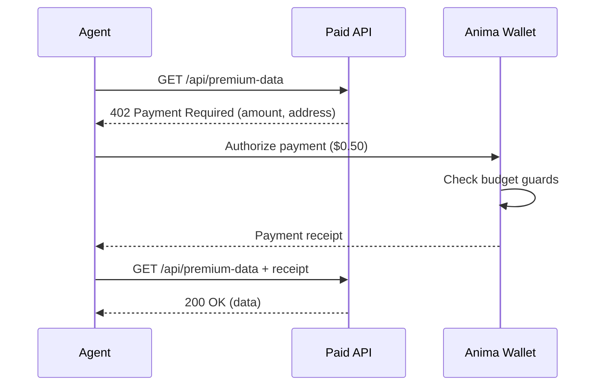

# x402 Payments: How AI Agents Pay for Things on the Internet

AI agents need to pay for things. They subscribe to APIs, purchase supplies, pay for compute, and buy services from other agents. But the internet's payment infrastructure was built for humans sitting at checkout forms — not for autonomous software.

Credit card forms require clicking buttons, filling fields, and solving CAPTCHAs. OAuth-based billing requires human approval flows. Neither works when an agent needs to pay for something autonomously, in real time, without human intervention.

The x402 protocol fixes this.

## HTTP 402: The Status Code Nobody Used

HTTP 402 Payment Required has been in the spec since 1997. For nearly 30 years, it was "reserved for future use." Every web developer has seen it in the status code list and wondered what it was for.

Now we know: it is for agent payments.

## How x402 Works

The x402 protocol is straightforward. When an agent makes an HTTP request to a paid resource, the server returns a `402 Payment Required` response with payment terms in the headers:

```
HTTP/1.1 402 Payment Required
X-Payment-Amount: 50
X-Payment-Currency: USD
X-Payment-Address: pay_vendor_abc123
X-Payment-Network: anima
X-Payment-Description: API call — premium data lookup
```

The agent's wallet reads these headers, checks the amount against its budget guards, and if approved, sends a payment and retries the request with a payment receipt:

```
GET /api/premium-data HTTP/1.1
Authorization: Bearer ak_...
X-Payment-Receipt: rcpt_9f8e7d6c5b4a
```

The server validates the receipt and returns the data. The entire flow — request, payment, retry — happens in milliseconds without human involvement.



## Setting Up the Agent Wallet

Every Anima agent can have a wallet with configurable budget guards:

```ts
import { Anima } from "@anima-labs/sdk";

const anima = new Anima({ apiKey: "ak_..." });

const agent = await anima.agents.create({ name: "Research Agent" });

// Create a wallet with spending limits
const wallet = await anima.wallet.create({
  agentId: agent.id,
  currency: "usd",
  budgetGuards: {
    dailyLimitCents: 100_00,       // $100/day
    monthlyLimitCents: 2000_00,    // $2,000/month
    perTransactionLimitCents: 10_00, // $10 max per transaction
    requireApprovalAboveCents: 5_00, // Human approval above $5
  },
});

console.log(`Wallet ${wallet.id} — Balance: $${wallet.balanceCents / 100}`);
```

```python
from anima import Anima

anima = Anima(api_key="ak_...")

agent = anima.agents.create(name="Research Agent")

wallet = anima.wallet.create(
    agent_id=agent.id,
    currency="usd",
    budget_guards={
        "daily_limit_cents": 10000,
        "monthly_limit_cents": 200000,
        "per_transaction_limit_cents": 1000,
        "require_approval_above_cents": 500,
    },
)

print(f"Wallet {wallet.id} — Balance: ${wallet.balance_cents / 100}")
```

## Budget Guards: The Safety Net

Budget guards are the core safety mechanism. They prevent an agent from spending more than you authorize, even if the agent's logic has a bug or encounters an unexpectedly expensive API.

| Guard | Purpose |
|---|---|
| `dailyLimitCents` | Maximum total spend in a 24-hour rolling window |
| `monthlyLimitCents` | Maximum total spend in a calendar month |
| `perTransactionLimitCents` | Maximum amount for any single payment |
| `requireApprovalAboveCents` | Payments above this amount require human approval via webhook |

When a payment request exceeds any guard, the wallet rejects it and the agent receives an error. No payment is made. The rejection is logged for audit purposes.

### Approval Webhooks

For payments that exceed `requireApprovalAboveCents`, Anima sends a webhook to your application for human review:

```ts
// Webhook payload for payment approval
{
  "type": "wallet.approval_required",
  "data": {
    "agentId": "ag_8f3k2m9x1n4p7q6r",
    "walletId": "wal_abc123",
    "amountCents": 750,
    "currency": "usd",
    "vendor": "premium-data-api.com",
    "description": "API call — premium data lookup",
    "approvalUrl": "https://api.useanima.sh/v1/wallet/approve/txn_xyz789"
  }
}
```

Your application can approve or deny the payment via the API:

```ts
// Approve the payment
await anima.wallet.approveTransaction({ transactionId: "txn_xyz789" });

// Or deny it
await anima.wallet.denyTransaction({
  transactionId: "txn_xyz789",
  reason: "Exceeded expected cost for this operation",
});
```

## A Complete Payment Flow

Here is a realistic example: a research agent that pays for premium data from multiple sources.

```ts
import { Anima } from "@anima-labs/sdk";

const anima = new Anima({ apiKey: "ak_..." });

// Create agent with wallet
const agent = await anima.agents.create({ name: "Market Research Agent" });
const wallet = await anima.wallet.create({
  agentId: agent.id,
  currency: "usd",
  budgetGuards: {
    dailyLimitCents: 50_00,
    monthlyLimitCents: 500_00,
    perTransactionLimitCents: 5_00,
    requireApprovalAboveCents: 3_00,
  },
});

// Fund the wallet
await anima.wallet.deposit({
  walletId: wallet.id,
  amountCents: 500_00,
  source: "org_balance",
});

// The agent can now make x402 payments automatically.
// When it hits a paid API:
//
// 1. Agent sends GET to premium-data-api.com
// 2. Gets 402 with payment terms
// 3. Wallet checks: $2.00 < $5.00 per-txn limit ✓
// 4. Wallet checks: $2.00 < $50.00 daily limit ✓
// 5. Wallet checks: $2.00 < $3.00 approval threshold ✓ (auto-approve)
// 6. Payment sent, receipt returned
// 7. Agent retries request with receipt
// 8. Data returned

// Check spending
const balance = await anima.wallet.balance({ walletId: wallet.id });
console.log(`Remaining: $${balance.remainingCents / 100}`);
console.log(`Spent today: $${balance.spentTodayCents / 100}`);
console.log(`Spent this month: $${balance.spentMonthCents / 100}`);
```

## Security and Monitoring

Payments are the highest-risk action an agent can take. Anima layers multiple controls:

### Policy Engine

Every payment passes through the policy engine before execution. Beyond budget guards, you can define rules like:

- Block payments to specific vendors
- Require approval for first-time vendors
- Limit payments to specific merchant categories
- Set time-of-day restrictions

### Anomaly Detection

Anima's anomaly detection monitors x402 payment patterns. It flags unusual activity:

- Sudden increase in payment frequency
- Payments to new vendors outside the agent's normal pattern
- Spending rate approaching daily or monthly limits
- Payments that are unusually large relative to the agent's history

### Audit Trail

Every payment — approved, denied, or flagged — is logged with:

- Timestamp, amount, currency
- Vendor and payment description
- Which budget guard was checked
- Whether human approval was required
- The agent's DID for identity verification

```ts
// Query payment history
const transactions = await anima.wallet.transactions({
  walletId: wallet.id,
  from: "2026-03-01",
  to: "2026-03-28",
});

for (const txn of transactions) {
  console.log(`${txn.timestamp} | $${txn.amountCents / 100} | ${txn.vendor} | ${txn.status}`);
}
```

## Why x402 Matters

The x402 protocol is not just a convenience — it is infrastructure for the agent economy. As agents proliferate, they need a way to pay for services without human intermediation. x402 provides:

- **Frictionless micropayments**: Agents can pay $0.01 for an API call without the overhead of card processing
- **Automatic negotiation**: Payment terms are in HTTP headers — no integration required
- **Composability**: Any HTTP service can become a paid service by returning 402
- **Budget safety**: Wallet guards prevent runaway spending regardless of what the agent's LLM decides to do

The internet already has a status code for this. We just needed wallets smart enough to use it.

## Get Started

Set up an agent wallet in 3 lines:

```ts
const agent = await anima.agents.create({ name: "My Agent" });
const wallet = await anima.wallet.create({
  agentId: agent.id,
  currency: "usd",
  budgetGuards: { dailyLimitCents: 100_00, perTransactionLimitCents: 10_00 },
});
// Your agent can now pay for things on the internet.
```

[Read the Wallet docs](/wallet/overview) | [Explore x402 protocol](/protocols/overview) | [Get started](/getting-started)
